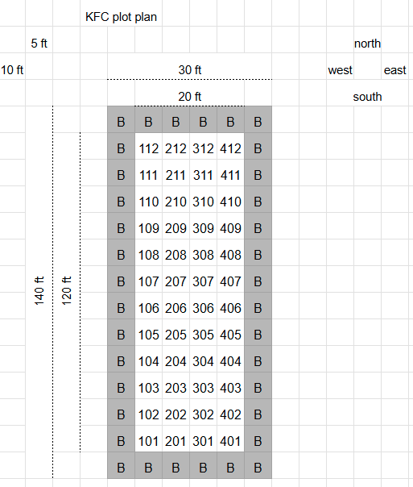

\newpage

# Trial specs

|  |  |
|----|----|
| trial description | comparing forage yield of different wheatgrass lines |
| contact | TLI, spencer [barriball\@landinstitute.org](mailto:barriball@landinstitute.org) |
| measurements | forage DM yield by plot at each forage harvest, field characterization, plant counts at establishment |
| trial start | 2024 Sept |
| trial end | 2026 Sept |
| row spacing | 12" |
| quadrat dimensions | 24" x 36" or 2 rows at 36" length = \~0.5m2 |
| quadrats per plot | 1 |
| quadrats per harvest | 48 |
| quadrats weighed for wet weight and dumped in field | 0 |
| quadrats back to campus for wet+dry weight, then discarded | 0 |
| quadrats back to campus for wet+dry in 95F, then ground for quality | 48 |
| management, forage | 1 cutting at anthesis |
| management, fertility | fertilize \@ 50 kg N ha once per year, spring or fall and as needed if crops look deficient |
| management, crop protection | herbicides (24D+dual), handweeding, gopher poisoning as needed |
| management, post harvest | cut to 3" and removed with new holland 36 |
| irrigation | none |
| field cropping history | vetch, then soybean, soybean harvested in August right before planting |
| field preparation | soil was amended with P,K,S etc based on predicted removal from forage harvests over 4 years, rototilled, rolled, rototilled, planted and then immediately rolled post planting |
| field characterization | baseline soil samples were taken right after emergence plant counts confirmed successful iwg stand achieved (0-15cm, 4 pushes per block) |

\newpage

## activities

|  |  |
|:-------:|---------------------------------------------------------------|
| **4/14** | spring wheat planted bulk in r37 |
| **9/4** | Fertilized one week prior. Rototilled, rolled, and royotilled again. The additional rototilling was because the seed bed was uneven after rolling. Planted plot length of 10.5 feet on setting 35. Standard IWG seeding depth. Rolled after planting. |
| **9/26** | Plant counts for new stands 2x 0.5meter lengths in different rows. Did not collect weed data |
| **10/8** | Applied 2, 4 d at \~1 pt per acre (1.3oz. per gallon plus 2oz. Class Act per gallon) to the experiment area plus around borders to control for broadleaf weeds using the 5 foot boom sprayer. |
| **10/28** | Fertilizer by hand by strips with urea to achieve 50 kg/ ha. (2 lbs per strip) |
| **10/29** | Soil sampled by block (did not get urea prills) for a baseline.  0-15 cm, 4 pushes per block. |

: 2024 field activities

|  |  |
|:-----:|-----------------------------------------------------------------|
| **4/17** | Fertilized with urea to achieve 60 lbs N per acre |
| **5/19** | Staging check |
| **6/5** | swapped metal falgs for plastic and moved them close to trial so they could mow alleys |
| **6/30** | Harvested all plots.  Definitely at anthesis for most plots.  2x 36 inch lengths taken from middle two rows of plot.  Katherine noted lodging of plots.  Pulled all but two flags from field to allow for station to clear. |
| **7/4** | Chopped with new holland at some point.  Actual date unknown- check with Darby and or Gary |
| **8/14** | Roughly marked the experiment boundary with tall flags and a whisker.  Very hard to tell while the IWG is short and the area is weedy. |

: 2025 field activities

## plot map



\newpage

# Population

Planted 4Sept2024

Plant counts collected 26Sept2024

Target population = 30 plants per meter

```{r}
library(tidyverse)

read.csv("KFC Master - data_all.csv") -> dat
  
```

```{r}
#| label: fig-population
#| fig-cap: "Plant counts 3 weeks after planting. X indicates mean. Dashed line indicates target population."


dat %>% 
  filter(activity == "plant counts") %>% 
  select(plot, trtIWG, iwg_count_1, iwg_count_2) %>% 
  mutate(iwg_count_avg = (iwg_count_1+iwg_count_2)/2) %>% 
  mutate(trtIWG = fct_reorder(trtIWG, iwg_count_avg,
                              .fun = mean)) %>% 
  ggplot() +
  geom_point(aes(trtIWG,iwg_count_1*2)) +
  geom_point(aes(trtIWG,iwg_count_2*2)) +
  stat_summary(
    aes(trtIWG,iwg_count_avg*2),
    geom = "point",
    col = 3,
    size = 4,
    shape = 4,
    stroke = 2
  ) +
  geom_hline(
    yintercept = 30,
    linetype = 2) +
  coord_flip() +
  labs(y="Plants per meter",
       x="")

```

\newpage

# Yield

Harvested 30June2025 by hand using quadrats

```{r}
#| label: fig-yield
#| fig-cap: "Forage yield at anthesis. X indicates mean."

dat %>% 
  filter(activity == "harvest") %>% 
  select(plot, trtIWG, yield_drymatter_kgha, moisture_percent, lodging_score) %>% 
  mutate(trtIWG = fct_reorder(trtIWG, yield_drymatter_kgha,
                              .fun = mean)) %>% 
  ggplot() +
  geom_point(aes(trtIWG,yield_drymatter_kgha)) +
  stat_summary(
    aes(trtIWG,yield_drymatter_kgha),
    geom = "point",
    col = "forestgreen",
    size = 4,
    shape = 4,
    stroke = 2
  ) +
  coord_flip() +
  labs(y="Dry matter yield at anthesis\n(kg / ha)",
       x="")

```

```{r}
#| label: fig-lodging
#| fig-cap: "Forage lodging scores at harvest. Yield presented for comparison. Notice some of the lower yielding plots had lower lodging as well."

dat %>%
  filter(activity == "harvest") %>%
  select(plot, trtIWG, yield_drymatter_kgha, lodging_score) %>%
  mutate(trtIWG = fct_reorder(trtIWG, lodging_score, .fun = mean)) %>%
  pivot_longer(
    cols = c(yield_drymatter_kgha, lodging_score),
    names_to = "variable",
    values_to = "value"
  ) %>%
  mutate(
    # rescale yield for plotting on same axis as lodging
    value_scaled = case_when(
      variable == "yield_drymatter_kgha" ~ value / 1250, # scale yield down
      TRUE ~ value
    ),
    # draw lodging points on top
    variable = factor(variable, levels = c("yield_drymatter_kgha", "lodging_score"))
  ) %>%
  ggplot(aes(x = trtIWG)) +
  # individual lodging points as triangles
  geom_point(
    data = . %>% filter(variable == "lodging_score"),
    aes(y = value_scaled),
    color = "orange",
    shape = 2,   # hollow triangle
    alpha = 0.5,
    position = position_jitter(width = 0.2, height = 0)
  ) +
  # mean points for both lodging and scaled yield
  stat_summary(
    aes(y = value_scaled, color = variable, shape = variable),
    geom = "point",
    fun = mean,
    size = 4,
    stroke = 2
  ) +
  coord_flip() +
  scale_color_manual(
    values = c(
      yield_drymatter_kgha = "forestgreen",
      lodging_score = "orange"
    ),
    labels = c(
      yield_drymatter_kgha = "Yield (scaled)",
      lodging_score = "Lodging score"
    )
  ) +
  scale_shape_manual(
    values = c(
      yield_drymatter_kgha = 4,  # X
      lodging_score = 2          # triangle
    ),
    labels = c(
      yield_drymatter_kgha = "Yield (scaled)",
      lodging_score = "Lodging score"
    )
  ) +
  labs(
    x = "",
    y = "Lodging score (yield scaled for comparison)",
    color = "Variable",
    shape = "Variable"
  ) +
  theme_minimal()

```
